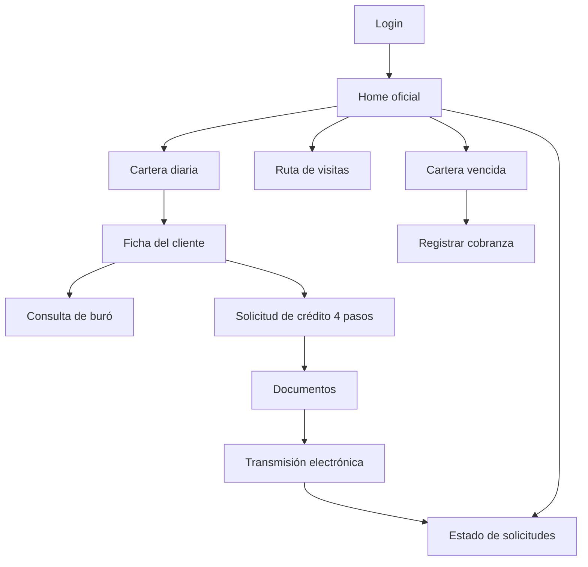

# Banco Alfin — App Fuerza de Ventas

Aplicación móvil Flutter para oficiales de crédito en campo: cartera diaria, ficha de cliente, solicitud de crédito, documentos, transmisión al comité, estado de solicitudes y cobranza.

## Stack

| Tecnología | Uso |
|------------|-----|
| **Flutter / Dart** | UI multiplataforma (Android, iOS, etc.) |
| **Material 3** | Componentes y navegación |
| **ChangeNotifier** | ViewModels (patrón MVVM) |
| **MaterialApp + rutas nombradas** | Navegación (sin GoRouter en esta versión) |
| **Supabase Flutter** | Auth, lecturas e inserts fase 1 (con fallback mock) |

## Arquitectura

**MVVM con `ChangeNotifier`:**

- **View (Screen):** widgets, eventos de usuario, `ListenableBuilder`
- **ViewModel:** estado, validaciones, datos mock
- **Model:** entidades en `domain/`
- **Repositorio local** (donde aplica): p. ej. `CobranzaLocalRepository`, preparado para backend

```
lib/
├── app/navigation/          # MaterialApp y rutas
├── core/constants/          # AppColors, AppTheme, AppRoutes
├── core/network/            # Infraestructura (no usada en demo)
├── core/storage/            # SQLite esqueleto (no usado en flujo demo)
├── core/supabase/           # Config, cliente, helper (timeout/logs)
├── features/<módulo>/data/  # Repositorios Supabase por feature
├── features/<módulo>/       # domain, data, presentation
└── shared/                    # widgets/utils compartidos (reservado)
```

## Estado actual

**Fase 1 Supabase + fallback mock.** Login, cartera, ficha, buró (insert), solicitud (insert) y cobranza (insert) intentan Supabase con sesión activa; el resto sigue simulado localmente.

## Supabase Ventas (fase 1)

### Configuración en Supabase

1. Crear usuario en **Authentication** (confirm email desactivado para pruebas):
   - Email: `ofi001@alfin.demo`
   - Password: `alfin123`
2. Ejecutar el SQL de ventas en el proyecto (tablas + RPC `crear_data_demo_ventas`).
3. Verificar que existan las tablas: `agencias`, `asesores_negocio`, `clientes`, `creditos`, `creditos_preaprobados`, `cartera_diaria`, `solicitudes_credito`, `consultas_buro`, `acciones_cobranza`, etc.

### Credenciales en la app

| Campo | Valor |
|-------|-------|
| Código de empleado (UI) | `OFI001` |
| Contraseña | `alfin123` |
| Email Auth interno | `ofi001@alfin.demo` |

El login convierte automáticamente `OFI001` → `ofi001@alfin.demo` para Supabase Auth.

### Módulos conectados a Supabase

| Módulo | Operación | Fallback mock |
|--------|-----------|---------------|
| **Login** | Auth + RPC `crear_data_demo_ventas` | Solo si Supabase no está configurado |
| **Perfil asesor** | Lectura `asesores_negocio` | Nombre "Oficial Alfin" |
| **Cartera diaria** | Lectura `cartera_diaria` + `clientes` | 5 clientes seed locales |
| **Ficha cliente** | Lectura `clientes`, `creditos`, `creditos_preaprobados` | Mock por `clientId` |
| **Buró** | Insert `consultas_buro` (resultado sigue siendo mock) | Solo insert omitido |
| **Solicitud crédito** | Insert `solicitudes_credito` | Expediente `ALF-LOCAL-*` |
| **Cobranza acción** | Insert `acciones_cobranza` | Solo repositorio local |

### Módulos que siguen mock/local

- Home dashboard (resumen calculado localmente)
- Ruta de visitas
- Documentos y transmisión
- Estado de solicitudes (tablero mock)
- Reportes del oficial
- Listado cartera vencida (lectura local; escritura híbrida)

### Fallback

Si Supabase no está configurado, falla la inicialización o hay error de red/timeout (15 s), la app continúa en **modo demo** con datos locales. Si Supabase está activo y las credenciales son incorrectas, se muestra error claro (no hay bypass).

### Verificar datos en Supabase

Tras login con `OFI001 / alfin123`:

1. **Authentication** → usuario `ofi001@alfin.demo` con sesión activa.
2. **Table Editor** → `asesores_negocio`: fila con `user_id` del auth user.
3. **cartera_diaria** / **clientes**: datos creados por RPC demo.
4. Tras consulta buró → fila en **consultas_buro**.
5. Tras enviar solicitud → fila en **solicitudes_credito**.
6. Tras registrar cobranza → fila en **acciones_cobranza**.

Logs de depuración en consola: prefijo `DEBUG VENTAS SUPABASE:`.

### Checklist de pruebas Supabase Ventas

| # | Prueba | Resultado esperado |
|---|--------|-------------------|
| 1 | Login `OFI001` / `alfin123` | Sesión activa, logs `auth login OK`, asesor cargado |
| 2 | Cartera diaria | Lista desde `cartera_diaria` + `clientes` (o 5 mock si falla) |
| 3 | Ficha cliente | Datos desde `clientes`, `creditos`, `creditos_preaprobados` |
| 4 | Consulta buró | Fila nueva en `consultas_buro` con `dni_consultado`, `resultado_json` |
| 5 | Nueva solicitud | Fila en `solicitudes_credito` con `numero_expediente` `EXP-ALF-2026-*` |
| 6 | Registrar cobranza | Fila en `acciones_cobranza` con `asesor_id`, `timestamp_gestion` |

Verificar en consola los logs por módulo (`cartera`, `ficha`, `buro`, `solicitud`, `cobranza`). Si falla un insert, debe aparecer `logError` y la app continúa en modo local.

## Credenciales demo

Con Supabase configurado, use las credenciales reales arriba. Sin Supabase, el login acepta cualquier código/contraseña no vacíos (modo demo offline).

## Flujo principal



1. **Login** — Acceso institucional Banco Alfin  
2. **Home oficial** — Resumen y accesos rápidos  
3. **Cartera diaria** — 5 clientes con tipo de gestión y estado  
4. **Planificación de ruta** — Visitas, optimización mock, mapa simulado  
5. **Ficha del cliente** — Posición, historial, oferta  
6. **Consulta de buró** — Consentimiento, firma simulada, resultado APTO/REVISAR/BLOQUEADO  
7. **Solicitud de crédito** — Wizard 4 pasos con simulación de cuota  
8. **Captura de documentos** — Checklist obligatorios/opcionales  
9. **Transmisión electrónica** — Pasos de envío al comité  
10. **Estado de solicitudes** — Tablero y detalle con línea de tiempo  
11. **Cartera vencida / cobranza** — Mora por prioridad y registro de gestión  

## Cómo ejecutar

```bash
# Dependencias
flutter pub get

# Ejecutar en dispositivo o emulador
flutter run

# Análisis estático
flutter analyze

# APK de depuración (evaluación)
flutter build apk --debug
```

APK generado: `build/app/outputs/flutter-apk/app-debug.apk`

## Funcionalidades mock / local

- Autenticación sin validación remota  
- Cartera, ficha, buró, solicitud, documentos, transmisión, estado, ruta, cobranza  
- Expedientes y expedientes oficiales generados localmente (`ALF-LOCAL-*`, `EXP-ALF-2026-*`)  
- Coordenadas y mapas simulados  
- Firmas y captura de documentos simuladas  
- PDF, navegación externa (Waze/Maps) y notificaciones: mensaje “siguiente fase”  

## Fase backend (pendiente)

| Componente | Objetivo |
|----------|----------|
| **Supabase Auth** | Login real de oficiales |
| **Supabase Database** | Cartera, solicitudes, cobranza, estado |
| **SQLite offline** | Cola y borradores en campo |
| **Supabase Storage** | Documentos e imágenes |
| **Google Maps** | Mapa y ruta real |
| **Geolocator** | GPS en visitas y cobranza |
| **Firebase Messaging** | Alertas de mora y estado |
| **PDF real** | Compartir estado de solicitud |

## Documentación de evaluación

- [`docs/CHECKLIST_EVALUACION.md`](docs/CHECKLIST_EVALUACION.md) — Matriz de requisitos  
- [`docs/EVIDENCIAS_DEMO.md`](docs/EVIDENCIAS_DEMO.md) — Capturas sugeridas  
- [`docs/RESUMEN_TECNICO.md`](docs/RESUMEN_TECNICO.md) — Arquitectura y módulos  

## Branding

Paleta y logo de Banco Alfin en `lib/core/constants/app_colors.dart`, `app_theme.dart` y `assets/images/alfin_logo.png`.

## Licencia / uso

Proyecto académico / demostrativo — Banco Alfin (Fuerza de Ventas).
