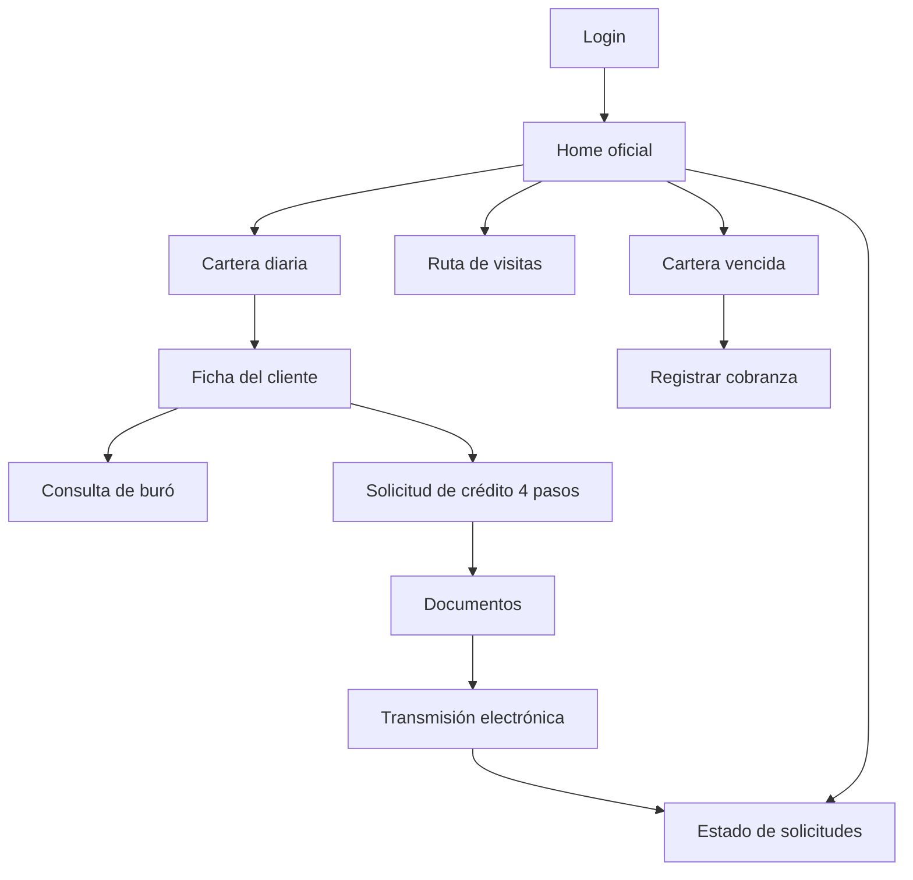

# App Fuerza de Ventas — Alfin Banco

Aplicación móvil Flutter para oficiales de crédito en campo: cartera diaria, ficha de cliente, solicitud de crédito, documentos, transmisión al comité, estado de solicitudes y cobranza.

## Stack

| Tecnología | Uso |
|------------|-----|
| **Flutter / Dart** | UI multiplataforma (Android, iOS, etc.) |
| **Material 3** | Componentes y navegación |
| **ChangeNotifier** | ViewModels (patrón MVVM) |
| **MaterialApp + rutas nombradas** | Navegación (sin GoRouter en esta versión) |

Dependencias declaradas para fases futuras (Supabase, mapas, cámara, etc.) están en `pubspec.yaml` pero **no se usan en el flujo demo actual**.

## Arquitectura

**MVVM con `ChangeNotifier`:**

- **View (Screen):** widgets, eventos de usuario, `ListenableBuilder`
- **ViewModel:** estado, validaciones, datos mock
- **Model:** entidades en `domain/`
- **Repositorio local** (donde aplica): p. ej. `CobranzaLocalRepository`, preparado para backend

```
lib/
├── app/navigation/          # MaterialApp y rutas
├── core/constants/          # AppColors, AppTheme, AppRoutes
├── core/network/            # Infraestructura (no usada en demo)
├── core/storage/            # SQLite esqueleto (no usado en flujo demo)
├── core/supabase/           # Cliente configurado (no usado en flujo demo)
├── features/<módulo>/       # domain, data, presentation
└── shared/                    # widgets/utils compartidos (reservado)
```

## Estado actual

**Versión mock/local demostrativa.** Todos los datos de negocio son simulados en memoria o hardcodeados. No hay persistencia real de solicitudes ni sincronización con servidor.

## Credenciales demo

El login está en **modo demostración**: acepta cualquier código y contraseña con longitud válida en UI.

| Campo | Valor de referencia (opcional) |
|-------|--------------------------------|
| Código de empleado | `OFI001` (o cualquier texto) |
| Contraseña | `alfin123` (o cualquier texto) |

Tras ~900 ms de carga simulada, ingresa al **Home del oficial**.

## Flujo principal



1. **Login** — Acceso institucional Alfin Banco  
2. **Home oficial** — Resumen y accesos rápidos  
3. **Cartera diaria** — 5 clientes con tipo de gestión y estado  
4. **Planificación de ruta** — Visitas, optimización mock, mapa simulado  
5. **Ficha del cliente** — Posición, historial, oferta  
6. **Consulta de buró** — Consentimiento, firma simulada, resultado APTO/REVISAR/BLOQUEADO  
7. **Solicitud de crédito** — Wizard 4 pasos con simulación de cuota  
8. **Captura de documentos** — Checklist obligatorios/opcionales  
9. **Transmisión electrónica** — Pasos de envío al comité  
10. **Estado de solicitudes** — Tablero y detalle con línea de tiempo  
11. **Cartera vencida / cobranza** — Mora por prioridad y registro de gestión  

## Cómo ejecutar

```bash
# Dependencias
flutter pub get

# Ejecutar en dispositivo o emulador
flutter run

# Análisis estático
flutter analyze

# APK de depuración (evaluación)
flutter build apk --debug
```

APK generado: `build/app/outputs/flutter-apk/app-debug.apk`

## Funcionalidades mock / local

- Autenticación sin validación remota  
- Cartera, ficha, buró, solicitud, documentos, transmisión, estado, ruta, cobranza  
- Expedientes y expedientes oficiales generados localmente (`ALF-LOCAL-*`, `EXP-ALF-2026-*`)  
- Coordenadas y mapas simulados  
- Firmas y captura de documentos simuladas  
- PDF, navegación externa (Waze/Maps) y notificaciones: mensaje “siguiente fase”  

## Fase backend (pendiente)

| Componente | Objetivo |
|----------|----------|
| **Supabase Auth** | Login real de oficiales |
| **Supabase Database** | Cartera, solicitudes, cobranza, estado |
| **SQLite offline** | Cola y borradores en campo |
| **Supabase Storage** | Documentos e imágenes |
| **Google Maps** | Mapa y ruta real |
| **Geolocator** | GPS en visitas y cobranza |
| **Firebase Messaging** | Alertas de mora y estado |
| **PDF real** | Compartir estado de solicitud |

## Documentación de evaluación

- [`docs/CHECKLIST_EVALUACION.md`](docs/CHECKLIST_EVALUACION.md) — Matriz de requisitos  
- [`docs/EVIDENCIAS_DEMO.md`](docs/EVIDENCIAS_DEMO.md) — Capturas sugeridas  
- [`docs/RESUMEN_TECNICO.md`](docs/RESUMEN_TECNICO.md) — Arquitectura y módulos  

## Branding

Paleta y logo Alfin Banco en `lib/core/constants/app_colors.dart`, `app_theme.dart` y `assets/images/alfin_logo.png`.

## Licencia / uso

Proyecto académico / demostrativo — Banco Alfin (Fuerza de Ventas).
